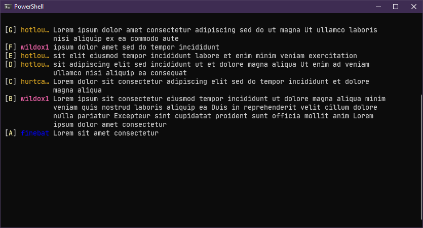

# readchat

a simple program to display twitch chat in your terminal

**note** this doesn't require an oauth token.

---

## usage:

> readchat some_channel

```
readchat 0.4.1

description:
    simply read-only client for a single twitch channel's chat

usage:
    readchat <channel>

flags:
    -h, --help             prints this message
    -v, --version          prints the version
    -d, --debug            use simulated debug stream instead
    -t, --transcribe       log this channel to a file (when not in debug mode)
    -l, --log-dir          print the log directory and exit

optional flags:
    -n, --nick-max <int>   the max width before truncation of nicknames
    -b, --buffer-max <int> the number of messages to keep in the redraw queue
    -m, --min-width <int>  if window size is below this, use a compact view
    -s, --timestamp        render timestamps of messages, in the compact view

arguments:
    <string>               the twitch channel to join

```

---

## keybinds:

| key      | action                | remarks                                           |
| -------- | --------------------- | ------------------------------------------------- |
| `ctrl-c` | quit                  | ---                                               |
| `ctrl-r` | force a redraw        | ---                                               |
| `ctrl-d` | delete a line         | press `ctrl-d` to exit this mode without deleting |
| `<`      | shrink name column    | minimum is **5** columns                          |
| `>`      | grow name column      | maximum is **30** columns                         |
| `t`      | toggle the timestamps | only applicable in compact mode                   |

## deleting:

when you press `ctrl-d` the view will change to:



press the cooresponding letter on the bracket (the left most column) to delete that message. such as `C`.

if you don't want to delete a message, just press `ctrl-d` again to exit this view.

### design decisions:

while the 'mark view' is active. rendering is paused, but messages are still buffered.

this makes it easier to pick a line without the chat scrolling. but the downside is that when you exit the view all of the new messages are inserted instantly.

the 'marks' are generated in reverse order because the most commonly deleted messages are new ones. so.. `A` then backward to `Z`.

if you have more than `26` lines, the total available marks are: `A-Z0-9a-z`.

**NOTE** the numerals are in the middle so its easier to see the separation

---

## demo mode:

pass the `--debug` flag (e.g. `readchat --debug`)

you can set these `env vars` to configure this mode

| var                       | description                                  | default                 |
| ------------------------- | -------------------------------------------- | ----------------------- |
| `READCHAT_UNIQUE`         | how many unique chatters to generate         | **5** (names)           |
| `READCHAT_DURATION_LOWER` | lower bound of random range between messages | **150** (milliseconds)  |
| `READCHAT_DURATION_UPPER` | upper bound of random range between messages | **1500** (milliseconds) |
| `READCHAT_LENGTH_LOWER`   | lower bound of characters per message        | **5** (letters)         |
| `READCHAT_LENGTH_UPPER`   | upper bound of characters per message        | **300** (letters)       |
